# Keyestudio Vision Smart Car


## 1. Kit List

|  #   |                 Picture                  |                 Components                  | QTY  |
| :--: | :--------------------------------------: | :-----------------------------------------: | :--: |
|  1   | 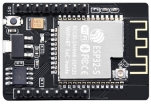 |                  ESP32-CAM                  |  1   |
|  2   |  |             Motor Driver Board              |  1   |
|  3   |  |                    Wheel                    |  2   |
|  4   |                  |               Camera Bracket                |  1   |
|  5   |         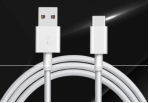         |                  USB Cable                  |  1   |
|  6   |                  |              Directional Wheel              |  1   |
|  7   |  |        M3*8 Dual-pass Copper Pillar         |  2   |
|  8   |  | M3*20+6MM Single-pass Copper Pillar |  2   |
|  9   |  |            M3*6 Flat Head Screw             |  4   |
|  10   |  |             3*83MM Screwdriver              |  1   |
|  11  | 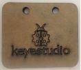 | 40*35mm M3 Acrylic Board |  1   |
|  12  |  |      16340 700mAh Pointed Lithium Battery (not provide)      |  1   |


## 2. Description   

The ESP32-CAM video car is a smart car based on the ESP32-CAM module. It has video transmission and remote control functions. The ESP32-CAM module is an IoT development board that integrates a camera and a Wi-Fi module, which is able to transmit images captured by the camera in real time. Combined with other electronic modules and components, a powerful video car can be built.

What's more, it provides four GPIO ports for expanding sensors and  modules, and Lego holes on both sides of the driver board make the car's gameplay more imaginative.


## 3. Parameters

USB voltage / charging voltage: 5V

Working voltage: 5V/3.3V

Battery voltage: 3.7V

Data transmission method: WiFi

Operating temperature: –10 to +65 degrees Celsius


## 4. Features    

(1). The car integrates the download circuit of the ESP32-CAM development board into a motor driver board, which greatly improves the convenience of using the ESP32-CAM.

(2). We have integrated the charging function of the car into the motor driver board.

(3). Simple assembly: we only need to assemble the directional wheel and wheels.

(4). Strong scalability: we use IIC to control the motor. The saved IO ports are used to expand the gameplay by itself, and holes are reserved for building Lego.


# 1.Product Assembly

The assembly of the video car is very simple, you only need to assemble the directional wheel and wheels.

Step 1: Fix the M3x8MM copper pillars to the directional wheel with screws.

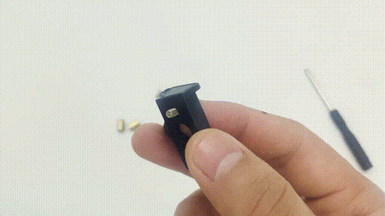

Step 2: Fix the directional wheel to the driver board of the car with M3x20+6MM copper pillars.

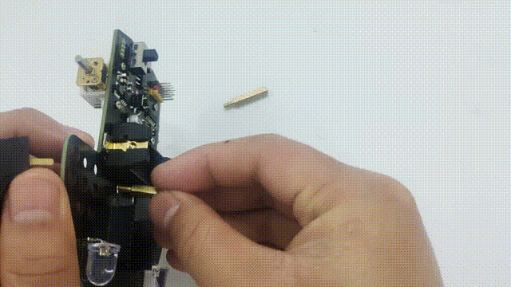

Step 3: Assemble the wheel onto the motor. Please note that the D-shaped slot of the wheel must be consistent with the one on the motor.


Step 4: Remove the protective film from the acrylic board.

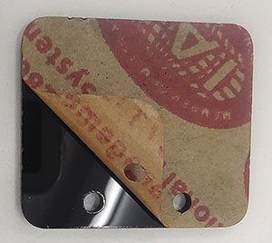

Step 5: After the battery is assembled (note: the positive and negative poles of the battery), then fasten it to the M3x20+6MM copper pillars with screws.


Step 6:Tear off the double-sided tape under the camera base and assemble it on the ESP32-CAM card slot so that it supports the camera at 90 degrees.


Step 7: Plug the ESP32-CAM development board into the car motor driver board, then the video car is successfully assembled.


​     

# 2.ESP32-CAM Mainboard

## (1). Introduction

ESP32-CAM is a development board based on the ESP32 chip, which integrates a camera module for building camera and video applications. The ESP32 chip is a low-power, high-performance Wi-Fi and Bluetooth dual-module solution with rich hardware resources and powerful software support.

Features：

1. High performance: The ESP32 chip uses a dual-core processor with a main frequency of up to 240MHz and has strong computing and processing capabilities.
2. Wi-Fi and Bluetooth functions: It can be connected to the network via Wi-Fi and communicate with other devices. Bluetooth function enables wireless connections with other Bluetooth devices.
3. Memory and storage: ESP32-CAM has 4MB of onboard Flash memory, which can be used to store programs and data. Likewise, it has a large amount of SRAM memory for running applications.
4. Camera module: The ESP32-CAM board integrates a camera module that can be used to capture photos and videos, then process and transmit them.
5. Peripheral interfaces: The ESP32-CAM board boasts rich peripheral interfaces such as UART, GPIO, I2C and SPI, which can be used to connect and communicate with other external devices.
6. Development environment: You can use Arduino IDE or other development environments that support ESP32 chips for programming and development.
7. Scalability: The pins on the ESP32-CAM board can be used to connect external sensors and modules such as temperature sensors and light sensors.

The ESP32-CAM development board is widely used in the IoT, smart homes, monitoring systems as well as robots, which is very suitable for realizing real-time video surveillance, image recognition, face recognition remote operation. At the same time, due to its rich functionality and good scalability, it is also one of the ideal choices for embedded system and IoT development.


## (2). Parameters

1. Smallest 802.11b/g/n Wi-Fi BT SoC module

2. Low-power 32-bit CPU that can also serve application processors

3. Clock speed is up to 160MHz, and the total computing power is up to 600 DMIPS

4. Built-in 520 KB SRAM and external 4MPSRAM

5. Support UART/SPI/I2C/PWM/ADC/DAC

6. Support OV2640 and OV7670 cameras with built-in flash

7. Support image WiFI upload

8. Support TF card

9. Support multiple sleep modes

10. Embedded Lwip and FreeRTOS

11. Support STA/AP/STA+AP operation modes

12. Support Smart Config/AirKiss technology

13. Support serial port local and remote firmware upgrade (FOTA)


## (3). ESP32-CAM Pinout

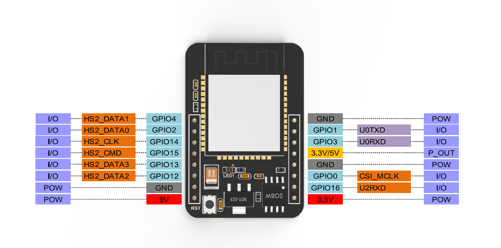


|  Camera   | ESP32 Pin |    SD     | ESP32 Pin |
| :-------: | :-------: | :-------: | :-------: |
|    D0     |   PIN5    |    CLK    |   PIN14   |
|    D1     |   PIN18   |    CMD    |   PIN15   |
|    D2     |   PIN19   |   DATA0   |   PIN2    |
|    D3     |   PIN21   | DATA1/LED |   PIN4    |
|    D4     |   PIN36   |   DATA2   |   PIN12   |
|    D5     |   PIN39   |   DATA3   |   PIN13   |
|    D6     |   PIN34   |           |           |
|    D7     |   PIN35   |           |           |
|   XCLK    |   PIN0    |           |           |
|   PCLK    |   PIN22   |           |           |
|   VSYNC   |   PIN25   |           |           |
|   HREF    |   PIN23   |           |           |
|    SDA    |   PIN26   |           |           |
|    SCL    |   PIN27   |           |           |
| POWER PIN |   PIN32   |           |           |


# 3. Motor Driver Board Introduction

  **(1). Introduction**

The motor driver board is designed for the ESP32-CAM video car, which boasts an automatic download circuit to download code for the ESP32-CAM via a USB cable. It also integrates a battery charging function and we can charge via a USB cable. What's more, four LEDs are used as power display. 

Discharge while charging is not supported. When the charging IC detects that there is a load consuming power, it will interrupt the charging function and change it to discharging function.  Thus if we need to charge, we only need to turn the switch OFF and plug in the USB cable.

We use the IIC method(use two pins) to control the motor. The specific principle is that we write code to receive IIC signal on a STC8G1K08 control chip of the motor driver board, then the ESP32-CAM sends the IIC signal to enable the two chips to communicate with the IIC. Thus the ESP32-CAM is capable of controlling the chip to output PWM signal to the HR8833 motor driver IC via the IIC communication in a way that controls the motor.

<p style="color:red">Note：ESP32-CAM can't use the SD card function when used together with the motor driver board due to pin conflict.</p>


**(2). Parameters**

1. Serial IC: CH340C
2. Motor driver IC: HR8833
3. Charging IC: ETA9740
4. USB voltage / charging voltage: 5V

5. Working voltage: 3.3V
6. Dimensions: 115*100mm
7. Battery model: 16340 3.7V lithium battery (not provide)

**(3). Pinout**


**(4). Schematic Diagram**

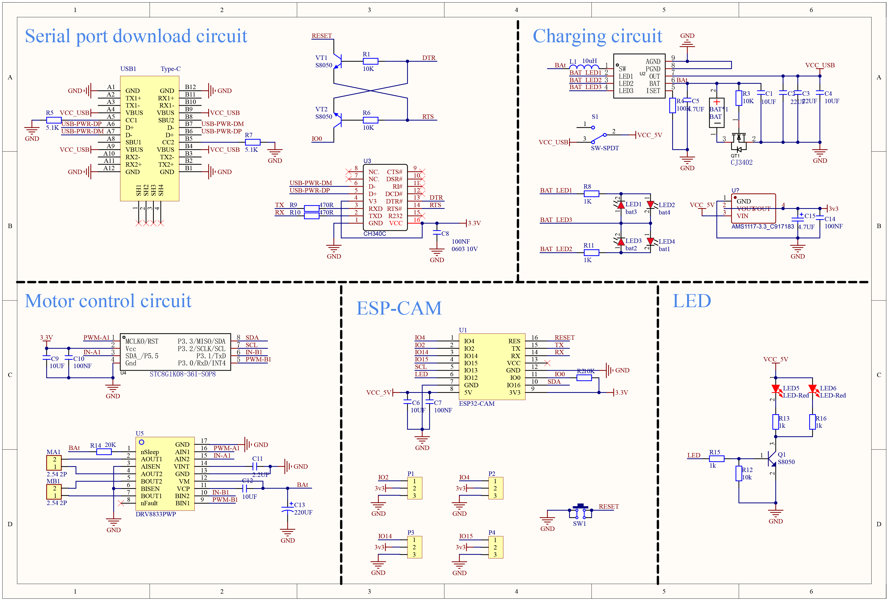

# 4. About Arduino IDE

## (1).Download Arduino IDE

### A.Windows System

Step 1: You could download Arduino IDE from the official website：[https://www.arduino.cc/](https://www.arduino.cc/)

Step 2: Enter the link and click **SOFTWARE**:


Step 3: There are various versions of IDE for Arduino. Just download a version compatible with your system. Here we will show you how to download and install the windows version of Arduino IDE. 

Tap “**Windows** win 10 and newer 64 bits” 


Step 4: You just need to click **JUST DOWNLOAD**.


Step 5: After the download is complete, we will get the .exe file, as shown below:


Step 6：Right-click “arduino-ide_2.2.1_Windows_64bit.exe” and tap “**Open**”.


Step 7：Tap “**I Agree**”.


Step 8：Tap “**Next**”


Step 9：First click ① "**Browse..**" to set the installation path of Arduino IDE, then click ② "**Install**".


Step 10：Wait for installation to complete.


Step 11：Click “**Run Arduino IDE**” and “**Finish**”.


### B. MAC System

Just download a version compatible with your computer system.


## (2).Install ESP32 Development Environment

### A：Install it on Arduino IDE

<p style="color:red">The following is a Windows system tutorial, MAC system can refer to it</p>

Typically, we cannot find ESP32 board from “Board” in “Tools”. Because we have not install this board on Arduino IDE yet. 


Here are the procedures of ESP32 board installation:

Open Arduino IDE.

Click “**File** ——>**Preferences**”

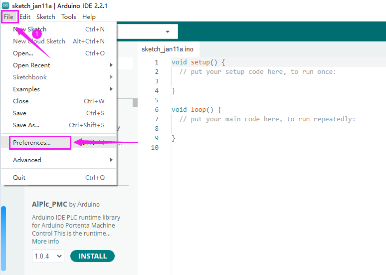

Copy the link of ESP32 board：“https://espressif.github.io/arduino-esp32/package_esp32_index.json” to Additional boards manager URLs and tap OK.

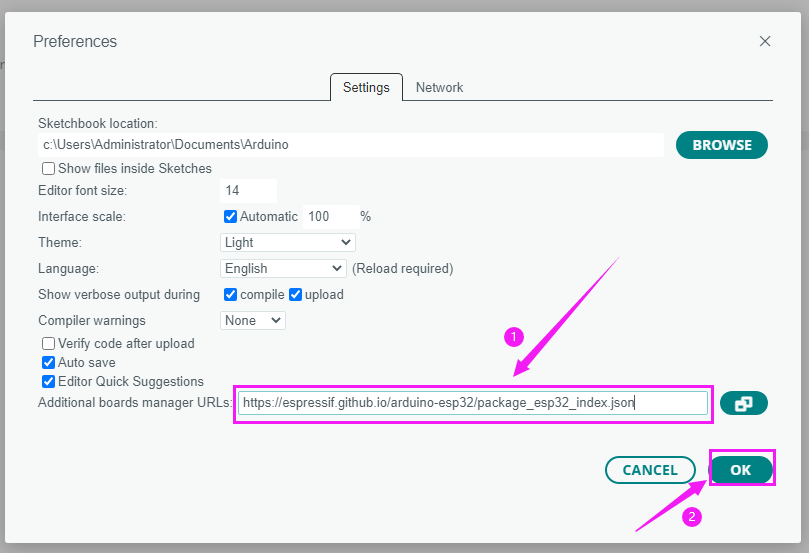

Click the icon of "Board Manager" to check for boards.


In the search bar, type in ESP32 and search to install the latest version. Then you just need to wait a few minutes for the installation to complete. 

**During installing, please ensure the stability of network. If it fails, please operate last step again to re-install it.**

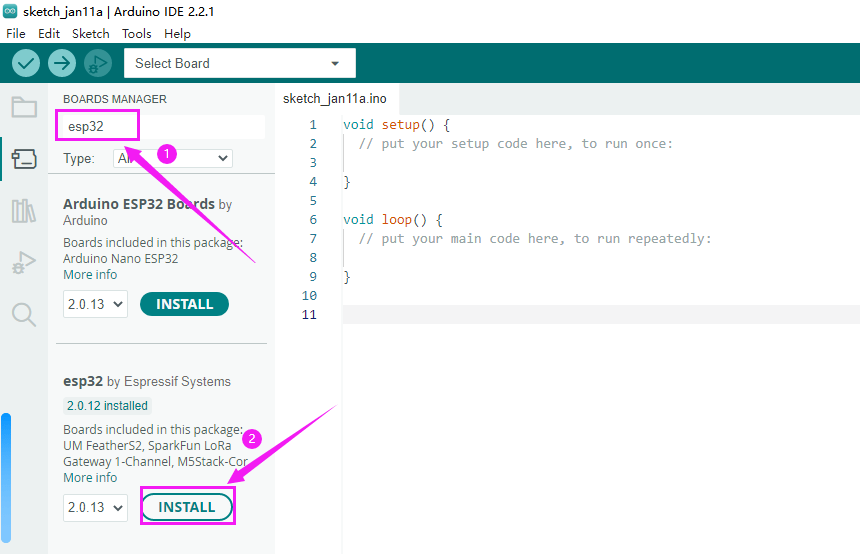

After installation, select the correct board model.

<p style="color:red">Note: The development board used on the video car must be “AI Thinker ESP32-CAM”</p>


### B：Download the provided offline installation package

<p style="color:red">This method is suitable for unstable networks and slow online downloads, and can put the offline package on a USB flash drive to install the ESP32 development environment for more Arduino IDEs.</p>

<p style="color:red">Note: This method only works on Windoes system</p>

Click the link to download the ESP32 offline installation package：[ESP32 Package 2.0.12](https://fs.keyestudio.com/esp32_package_2_0_12)

After the download is complete, unzip it and you will get a file named "**esp32_package_2.0.12_arduinome.exe**".


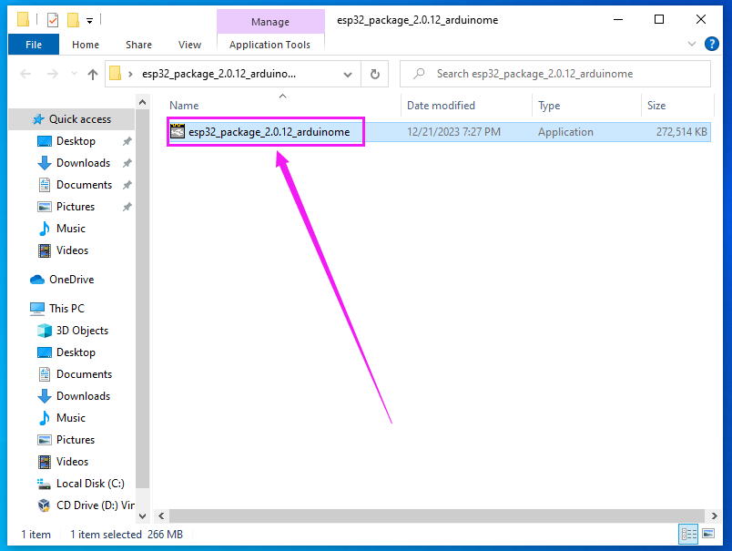

Tap “**Open**”.


Wait for the installation to complete, then restart the Arduino IDE to see the options for the ESP32 development board.

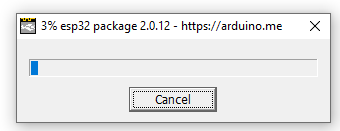


## (3).Install the CH340 driver on your computer

(1).Windows System

Enter the link：[Install CH340 Driver on Windows System — Getting started with Arduino documentation (getting-started-with-arduino.readthedocs.io)](https://getting-started-with-arduino.readthedocs.io/en/latest/windowsCH340.html)

(2).MAC System

Enter the link：[Install CH340 Driver on MAC System — Getting started with Arduino documentation (getting-started-with-arduino.readthedocs.io)](https://getting-started-with-arduino.readthedocs.io/en/latest/MacCH340.html)

## (4).Upload code to ESP32-CAM board via Arduino IDE

**A. Arduino IDE Interface**


1. “File”: Including New Sketch, Open..., Sketchbook, Examples, Close, Save(Save as...), Preferences, Advanced..., etc.
2. “Edit”: Including Copy, Paste, Auto Format, Increase/Decrease Font Size, etc. Commonly, you can use shortcuts to do these operations.
3. “Sketch”: Including Verify/Compile, Upload, Include Library, etc.
4. “Tools”: Including Board and Port, which are two of the most important functions. 
5. “Help”: Including Check for Updates as well as some official data references. 
6. “Serial Plotter”: To display the data from serial port in the way of a line chart.
7. “Serial Monitor”: To prints the data from serial port. 
8. Verify code.
9. Verify and upload code.
10. “Sketchbook”: To create a new sketch, or sign in to Arduino Cloud to sync and edit your Cloud Sketches.
11. “Boards Manager”: To install or remove development board. 
12. “Library Manager”: To install or remove library.
13. “Debug”: To monitor code and debug breakpoints.
14. Search.
15. Sketch editing area.
16. IDE Output: To report error or successful uploading, and to display data from serial monitor.

**B. Upload code**

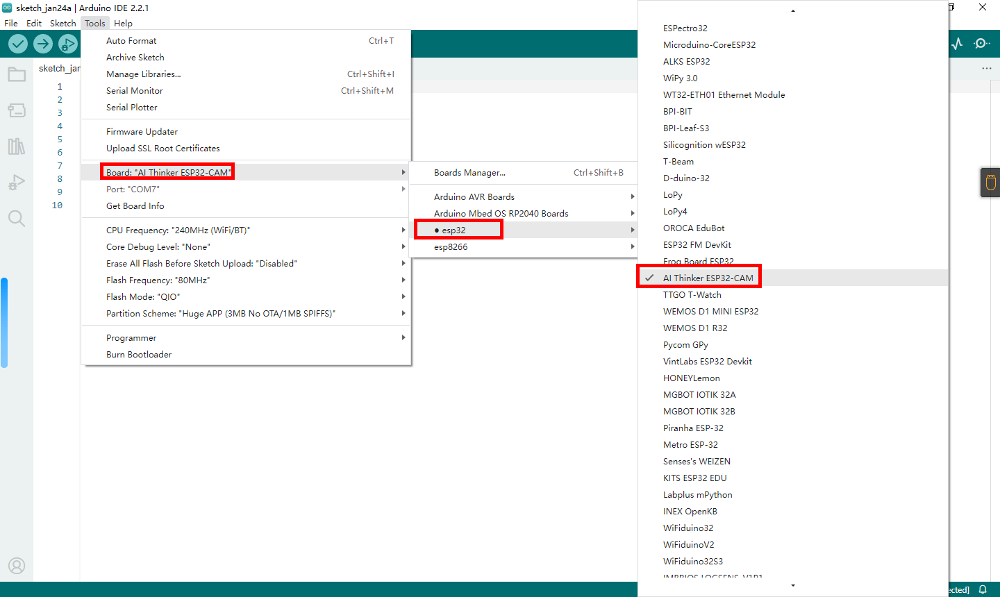

After selecting the development board, we need to select the COM port. After the development board installs the driver, a COM port will be displayed. If you don’t know which one to select, you can enter the device manager of your computer to check, as shown below: (If there are multiple COM ports and  you don’t know which one it is, you can unplug the development board and see which one disappears. Then plug in the development board and the missing COM port will be displayed again. If there is no COM, please check whether the development board driver is installed.)

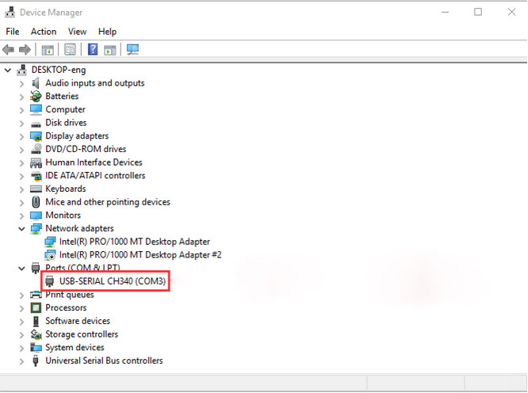

As can be seen from the picture, our COM port is COM3. We select "Port" in the "Tools" and then select "COM3".

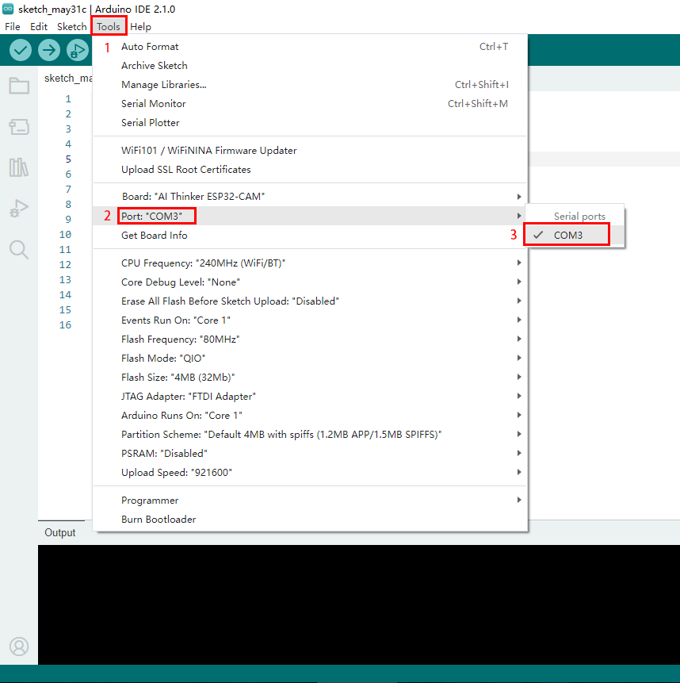

After connecting the development board, then we need to add code, here we provide a sample code, the function of the code is to print "Hello Keyestudio!" every second in the serial monitor.

Copy and paste the following code into the code area of arduino IDE.

```c
/*
  keyestudio 
  Print “Hello Keyestudio!”
  http://www.keyestudio.com
*/
void setup() {  
    // put your setup code here, to run once:
    Serial.begin(9600);  //Set the serial port baud rate to 9600
}

void loop() {  
    // put your main code here, to run repeatedly:
    Serial.println("Hello Keyestudio!");  //Serial port printing
 	delay(1000);  //Delay of 1 second
}
```


Tapto compile and upload the code. After the upload is successful, the prompts will appear, as shown in the figure:


Then tapto open the serial port monitor to set the baud rate to 9600, and you will see that the serial port printing the string "Hello Keyestudio!".


1. “Toggle Autoscroll”: Set whether the print window follows printing

2. “Toggle Timestamp ”: Set whether to display printing time

3. “Clear Output”: Clear data in print window

4. Serial port input box

5. Serial port sending format

6. Set the baud rate, click it to select the required baud rate

7. Print window

Now, please return to the main tutorial to learn how to add library files to Arduino IDE, otherwise the IDE will report an error.

# 5. Control the LEDs of the Car

**(1).Description**

The video car is equipped with two 10mm headlights. We will control the two LEDs with one pin, so that the status of the two LEDs is synchronized. No wiring is required, just plug the ESP32-CAM development board into the motor driver board of the video car.

**(2).Working Principle**

As can be seen from the schematic diagram, we connect the LED directly to the VCC of  5V, then we will use the triode Q1 as a switch. When the pin 1 of Q1 (IO12 pin of the ESP32-CAM) outputs high level, the pin 3 and pin 2 of Q1 are conducting (when the output is low level, pins 3 and 2 are not conducting), the VCC of 5V passes through the LED to the R13 current limiting resistor and then goes from pin 3 to pin 2 to GND to form a loop. (R15 is a current-limiting resistor, and R12 is a pull-down resistor to prevent the LED from being unstable when IO12 is in a high-impedance state).

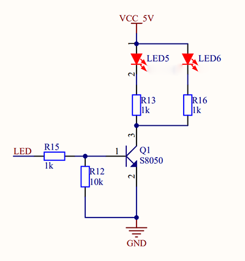

**(3).Code**

Tap it to download the code：[Codes](./Codes.zip)

```c
/*
  Keyestudio ESP32-CAM Video Smart Car
  Control LED Flashing
  https://www.keyestudio.com
*/
#define LED 12  //Define LED as 12 pin
void setup() {
  // put your setup code here, to run once:
  pinMode(LED,OUTPUT);  //Set IO12 pin as output
}

void loop() {
  // put your main code here, to run repeatedly:
  digitalWrite(LED,HIGH);   //IO12 pin outputs high level
  delay(1000);              //delay 1s
  digitalWrite(LED,LOW);    //IO12 pin outputs low level
  delay(1000);              //delay 1s
}
```

**(4).Test Result**

After the code is uploaded successfully, the LEDs light up for 1s and turn off for 1s.

**(5).Code Explanation**

1. `#define LED 12 `Define a constant called LED with a value of 12.

​	The form of defining a constant is：`#define constantName value`

​	**constantName**: the name of the macro to define.
​		**value**: the value to assign to the macro.

​	Official explanation link：[#define - Arduino Reference](https://www.arduino.cc/reference/en/language/structure/further-syntax/define/)

2. `pinMode(LED,OUTPUT);` Set pin mode 

 The form of setting the pin mode：`pinMode(Pin,mode);`

​	`pin`: the Arduino pin number to set the mode of.
​		`mode`: `INPUT`, `OUTPUT`, or `INPUT_PULLUP`. See the [Digital Pins](http://arduino.cc/en/Tutorial/DigitalPins) page for a more complete description of the functionality.

​	Official explanation link：[pinMode() - Arduino Reference](https://www.arduino.cc/reference/en/language/functions/digital-io/pinmode/)

3. `digitalWrite(LED,HIGH);` Control pin to output high and low level 

​	The form of controlling pin output：`digitalWrite(Pin,value);`

​	`pin`: the Arduino pin number.
​		`value`: `HIGH` or `LOW`.

​	Official explanation link：[digitalWrite() - Arduino Reference](https://www.arduino.cc/reference/en/language/functions/digital-io/digitalwrite/)

# 6. Control the Brightness of LEDs

**(1).Description**

A “breathing LED” is a phenomenon where an LED's brightness smoothly changes from dark to bright and back to dark, continuing to do so and giving the illusion of an LED“breathing. Thus how to control LED’s brightness? We need to use the PWM of ESP32 to achieve it.

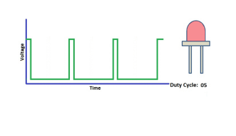

**(2). Working Principle of PWM**

**Analog & Digital：**

Analog signal are continuous signals in both time and value. On the contrary, a digital signal or discrete time signal is a time series consisting of a sequence of quantities. Most signals in life are analog signals. A familiar example of an analog signal would be how the temperature throughout the day continuously changes and could not change instantaneously from 0℃ to 10℃.

However, digital signals can instantaneously change in value. This change is expressed in numbers as 1 and 0 (the basis of binary code). Their differences can be seen more easily when compared, as shown below:


**PWM：**

PWM, Pulse-Width Modulation, is a very effective method for using digital signals to control analog circuits. Common processors cannot directly output analog signals. PWM technology makes it very convenient to achieve this conversion (translation of digital to analog signals). 

PWM technology uses digital pins to send certain frequencies of square waves, that is, the output of high levels and low levels, which alternately last for a while. The total time for each set of high levels and low levels is generally fixed, which is called the period (Note: the reciprocal of the period is frequency). The time of high level outputs is generally called “pulse width”, and the duty cycle is the percentage of pulse width (PW) to the total period (T) of the waveform.

The longer the output of high levels last, the longer the duty cycle and the higher the corresponding voltage in the analog signal will be. The following figures show how the analog signal voltages vary between 0V-3.3V(high level is 3.3V) corresponding to the pulse width 0%-100%:


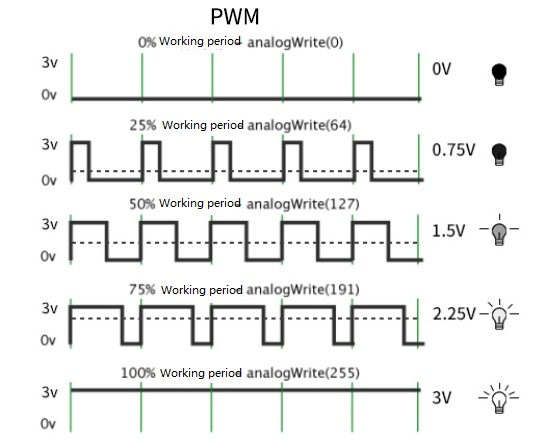

The longer the PWM duty cycle is, the higher the output power will be. Therefore, we can use PWM to control the brightness of an LED or the speed of DC motor and so on. It is evident from the above that PWM is not real analog, and the effective value of the voltage is equivalent to the corresponding analog. Then we can control the output power of the LED and other output modules to achieve different effects. 

**ESP32 and PWM**

On ESP32, the LEDC(PWM) controller has 16 separate channels, each of which can independently control frequency, duty cycle, and even accuracy. Unlike traditional PWM pins, the PWM output pins of ESP32 are configurable, with one or more PWM output pins per channel. The relationship between the maximum frequency and bit precision is shown in the following formula. 


The maximum value of bit is 31. For example, generate a PWM with an 8-bit precision (28=256. Values range from 0 to 255) with a maximum frequency of 80,000,000/255 = 312,500Hz.）

**Method for Arduino output PWM：**

**Method 1：** 

Use the `analogWrite(Pin,value)；`function，for details, refer to the link：[analogWrite() - Arduino Reference](https://www.arduino.cc/reference/en/language/functions/analog-io/analogwrite/)

**Method 2：**（Recommended）

Use the `ledcSetup()` function to configure the frequency and resolution of the PWM channel.

```c
ledcSetup(channel, freq, resolution);
```

- `channel`：PWM channel number to set.
- `freq`：Frequency of PWM in Hz.
- `resolution`：Resolution of PWM, that is, the number of bits of PWM.

Use the `ledcAttachPin()` function to connect the PWM channel to the specified pin.

```c
ledcAttachPin(pin, channel);
```

- `pin`：Pin number to connect.
- `channel`：PWM channel number to connect to.

Use ledcWrite(channel, dutyCycle); to output pwm

```c
ledcWrite(channel, dutyCycle);
```

- `channel`：PWM channel number to use, ranging from 0 to 15.

- `dutyCycle`：The duty cycle of PWM, ranging from 0 to 2^(resolution digits)-1, where resolution is the PWM resolution when calling the `ledcSetup()` function.

  **(3).Code**

  Tap it to download the code：[Codes](./Codes.zip)
  
  ```c
  /*
    Keyestudio ESP32-CAM Video Smart Car
    Control the brightness of LED
    https://www.keyestudio.com
  */
  #define LED 12  //Define LED as 12 pin
  void setup() {
    // put your setup code here, to run once:
    ledcSetup(0, 3000, 8);  //Set pwm channel, frequency and accuracy
    ledcAttachPin(LED, 0);  //Attach the IO port to the ledc channel
  }
  
  void loop() {
    // put your main code here, to run repeatedly:
    for (int i = 0; i < 255; i++) {  //for loop, control i to increase from 0 to 255
      ledcWrite(0, i);               //output pwm
      delay(10);
    }
    for (int i = 255; i > 1; i--) {  //for loop, control i to decrease from 255 to 0
      ledcWrite(0, i);               //output pwm
      delay(10);
    }
  }
  
  ```
  
  **(4).Test Result**
  
  After the code is uploaded successfully, the LEDs slowly turn from dark to bright and then from bright to dark.
  
  **(5).Code Explanation**
  
  ```c
    for (int i = 0; i < 255; i++) {  //for loop, control i to increase from 0 to 255
      ledcWrite(0, i);               //output pwm
      delay(10);
    }
  ```
  
  `for(int i = 0; i < 255; i++)`：`int i = 0` in the bracket is the starting value of the loop, `i < 255` is the loop condition. When the loop condition is not met, the for loop will exit. `i++` will add 1 to the value of i every time it loops. The loop will exit when the value of i reaches 256.
  
  `for (int i = 255; i > 1; i--)`：The loop is the opposite of the above, the starting value is 255, `i--` decreases the value of i by 1 every time it loops, and exits the loop when the value of i is 0.
  
  For details, refer to the link：[for - Arduino Reference](https://www.arduino.cc/reference/en/language/structure/control-structure/for/)

# 7. Motor Drive Mode

**(1).Description**

We use IIC to control the motor driver, thus saving several pins for expansion.

**(2).Working Principle**

ESP32-CAM serves as the host and STC8G1K08 serves as the slave for IIC communication. The ESP32-CAM controls STC8G1K08 to output PWM signals to DR8833 via IIC in a way that controls the rotation of the motor. If you are interested in the principles of IIC communication, you can search for relevant information online. We have encapsulated it here and you can use the function directly.

**Functions in SetMotor.h library：**

`i2c_init();`Initialize the IIC function. When using a motor driver, you must add this function.

`Car_forward(value1, value2);`Car forward function, value1 is the forward speed value of the right wheel, value2 is the forward speed value of the left wheel.

`Car_backwards(value1, value2);`Car retreat function, value1 is the speed value of the right wheel retreating, value2 is the speed value of the left wheel retreating.

`Car_left(value1, value2);`Car left turn function, value1 is the forward speed value of the right wheel, value2 is the backward speed value of the left wheel.

`Car_right(value1, value2);`Car right turn function, value1 is the backward speed value of the right wheel, value2 is the forward speed value of the left wheel.

`Car_stop();`Car stop function.

**(3).Code**

`Don't copy the code after downloading it, just open it. The library file and the code are in the same folder.`

Tap it to download the code：[Codes](./Codes.zip)

```c
/*
  Keyestudio ESP32-CAM Video Smart Car
  Motor Driver
  https://www.keyestudio.com
*/
#include "SetMotor.h"
void setup() {
  // put your setup code here, to run once:
  i2c_init();  //initialize iic
}

void loop() {
  // put your main code here, to run repeatedly:
  Car_forward(200, 200);    //The car moves forward
  delay(2000);              //delay 2s
  Car_backwards(200, 200);  //The car moves back
  delay(2000);
  Car_left(100, 100);  //The car turns left
  delay(2000);
  Car_right(100, 100);  //The car turns right
  delay(2000);
  Car_stop();  //The car stops
  delay(2000);
}
```

**(4).Test Result**

After the code is uploaded successfully, the car moves forward for 2s, goes back for 2s, turns left for 2s, turns right for 2s, then stops for 2s.

**(5).Code Explanation**

`#include "SetMotor.h"`: This code includes the "SetMotor.h" file we write, so that the code integrated in SetMotor.h can be called.

Official explanation link：[#include - Arduino Reference](https://www.arduino.cc/reference/en/language/structure/further-syntax/include/)


# 8. Video Smart Car

**(1).Description**

The ESP32-CAM development board boasts a camera and wifi function. Video signals are transmitted to the control end (mobile phone or computer) through wifi, and the control signals from the control end are also transmitted to ESP32-CAM through wifi. The APP control method is abandoned and enter the IP printed by the serial port of the car on the browser of the control end, then we are able to enter the control page.

**(2).Function**

The ESP32-CAM development board boasts Wi-Fi (2.4G) and Bluetooth (4.2) functions, which can be easily connected to the Wi-Fi network and communicate with other devices in the network. You can use the ESP32-CAM to display the webpage in the browser.

**arduino IDE provides \<WiFi.h\>library files，Wi-Fi library supports configuration and monitoring of ESP32 Wi-Fi networking functions.**

- Base station mode (STA mode or Wi-Fi client mode), when ESP32 is connected to a Wi-Fi hotspot (AP).
- AP mode (Soft-AP mode or Wi-Fi hotspot mode), when other Wi-Fi devices are connected to the ESP32.
- AP-STA coexistence mode (ESP32 is both a Wi-Fi hotspot and a Wi-Fi device connected to another Wi-Fi hotspot).
- The above modes support multiple security modes (WPA, WPA2 and WEP).
- Search Wi-Fi hotspots (including active scanning and passive scanning).
- Support promiscuous mode monitoring of IEEE802.11 Wi-Fi packets.

For more wifi reference, please go to Espressif’s official documentation：[https://docs.espressif.com/projects/esp-idf/en/latest/esp32/api-reference/network/esp_wifi.html](https://docs.espressif.com/projects/esp-idf/en/latest/esp32/api-reference/network/esp_wifi.html)

Official link for Espressif：[https://www.espressif.com.cn/en/home](https://www.espressif.com.cn/en/home)

**Webpage introduction：**

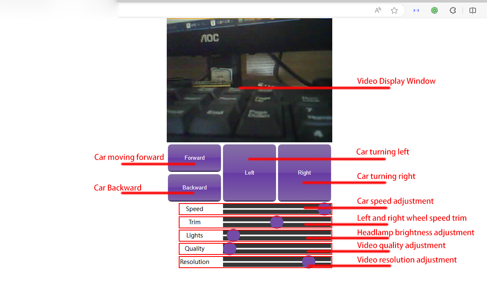


**Operation animation example：**

<p style="color:red">A problem that often occurs when using the web version is that long-pressing the browser page will enter the recognition mode, so how should we solve it? If you need to move forward, first click the forward button and then press the left or right turn button while holding the forward button, so that you will not enter the recognition mode.</p>


**(3).Code**

<p style="color:red">Note: It is prohibited to copy the code and upload it. You can only use the code file we provide to open the upload with Arduino IDE, otherwise errors will appear!</p>

**The following is the main code. The web page code, control car and video transmission codes are all in the `app_server.h` file. Since this knowledge involves extracurricular knowledge such as HTML, CSS and  JS, please consult the relevant information if you want to know more.**

Tap it to download the code：[Codes](./Codes.zip)

```c
/*
  keyestudio  ESP32-CAM Video Smart Car
  Define Network SSID & Password
  Set ap to 1 to use ESP32-CAM as Standalone Access Point with default IP 192.168.4.1
  Set ap to 0 to connect to a router using DHCP with hostname espressif
*/
#include <WiFi.h>
#include "esp_wifi.h"
#include "esp_camera.h"
#include "soc/soc.h"
#include "soc/rtc_cntl_reg.h"
#include "SetMotor.h"
#include "app_server.h"

// bool ap = 0;  //When it is 1, esp32 turns on wifi, the mobile phone is connected, and the IP is 192.168.4.1; when it is 0, it is connected to wifi, and the IP needs to be obtained through serial port printing.
// const char* ssid = "ChinaNet_2.4G";        //AP Name or Router SSID
// const char* password = "ChinaNet@233";  //Password. Leave blank for open network.

bool ap = 1;
const char* ssid = "keyes1";        //AP Name or Router SSID
const char* password = "88888888";  //Password. Leave blank for open network.


//AP Settings
int channel = 11;       // Channel for AP Mode
int hidden = 0;         // Probably leave at zero
int maxconnection = 1;  // Only allow one device to connect

// Camera Pin Definitions - Don't heckin' touch.
#define PWDN_GPIO_NUM 32
#define RESET_GPIO_NUM -1
#define XCLK_GPIO_NUM 0
#define SIOD_GPIO_NUM 26
#define SIOC_GPIO_NUM 27
#define Y9_GPIO_NUM 35
#define Y8_GPIO_NUM 34
#define Y7_GPIO_NUM 39
#define Y6_GPIO_NUM 36
#define Y5_GPIO_NUM 21
#define Y4_GPIO_NUM 19
#define Y3_GPIO_NUM 18
#define Y2_GPIO_NUM 5
#define VSYNC_GPIO_NUM 25
#define HREF_GPIO_NUM 23
#define PCLK_GPIO_NUM 22

// Webserver / Controls Function
void startCameraServer();

void setup() {
  // WRITE_PERI_REG(RTC_CNTL_BROWN_OUT_REG, 0); // Prevent brownouts by silencing them. You probably want to keep this.
  i2c_init();  //Initialize IIC, SDA is IO14, SCL is IO13, the pins are bound to the motor driver board and cannot be modified.

  Serial.begin(115200);
  Serial.setDebugOutput(true);
  Serial.println();

  // Camera Configuration - Again, don't touch.
  camera_config_t config;
  config.ledc_channel = LEDC_CHANNEL_0;
  config.ledc_timer = LEDC_TIMER_0;
  config.pin_d0 = Y2_GPIO_NUM;
  config.pin_d1 = Y3_GPIO_NUM;
  config.pin_d2 = Y4_GPIO_NUM;
  config.pin_d3 = Y5_GPIO_NUM;
  config.pin_d4 = Y6_GPIO_NUM;
  config.pin_d5 = Y7_GPIO_NUM;
  config.pin_d6 = Y8_GPIO_NUM;
  config.pin_d7 = Y9_GPIO_NUM;
  config.pin_xclk = XCLK_GPIO_NUM;
  config.pin_pclk = PCLK_GPIO_NUM;
  config.pin_vsync = VSYNC_GPIO_NUM;
  config.pin_href = HREF_GPIO_NUM;
  config.pin_sscb_sda = SIOD_GPIO_NUM;
  config.pin_sscb_scl = SIOC_GPIO_NUM;
  config.pin_pwdn = PWDN_GPIO_NUM;
  config.pin_reset = RESET_GPIO_NUM;
  config.xclk_freq_hz = 20000000;
  config.pixel_format = PIXFORMAT_JPEG;
  //init with high specs to pre-allocate larger buffers
  if (psramFound()) {
    config.frame_size = FRAMESIZE_QVGA;
    config.jpeg_quality = 10;
    config.fb_count = 2;
  } else {
    config.frame_size = FRAMESIZE_QVGA;
    config.jpeg_quality = 12;
    config.fb_count = 1;
  }
  // camera init
  esp_err_t err = esp_camera_init(&config);
  if (err != ESP_OK) {  //ESP_OK
    Serial.printf("Camera init failed with error 0x%x", err);
    return;
  }
  //drop down frame size for higher initial frame rate
  sensor_t* s = esp_camera_sensor_get();
  s->set_framesize(s, FRAMESIZE_QVGA);
  //Video flip code
  s->set_vflip(s, 1);
  s->set_hmirror(s, 1);
  // s->set_vflip(s, 0);
  // s->set_hmirror(s, 0);

  ledcSetup(7, 5000, 8);
  ledcAttachPin(12, 7);  //IO12 is the LED control pin and cannot be changed.

  if (!ap) {
    // Connect to Router
    Serial.println("ssid: " + (String)ssid);
    Serial.println("password: " + (String)password);
    Serial.println("WiFi is Client Scout32");
    WiFi.mode(WIFI_STA);
    WiFi.begin(ssid, password);
    while (WiFi.status() != WL_CONNECTED) {
      delay(500);
      Serial.print(".");
    }
    Serial.print("Camera Ready! Use 'http://");
    Serial.print(WiFi.localIP());
    Serial.println("' to connect");
  } else {
    // Setup Access Point
    Serial.println("ssid: " + (String)ssid);
    Serial.println("password: " + (String)password);
    Serial.println("WiFi is Standalone Scout32");
    WiFi.mode(WIFI_AP);
    WiFi.softAP(ssid, password, channel, hidden, maxconnection);
    Serial.print("Camera Ready! Use 'http://");
    Serial.print(WiFi.softAPIP());
    Serial.println("' to connect");
  }

  //Flash LED as ready indicator
  for (int i = 0; i < 5; i++) {
    ledcWrite(7, 0);  // flash led
    delay(200);
    ledcWrite(7, 255);
    delay(200);
  }

  //Start Webserver
  startCameraServer();
}

int i = 0;

void loop() {
  // put your main code here, to run repeatedly:
  delay(1000);
  // Serial.printf("RSSi: %ld dBm\n",WiFi.RSSI());

}

```

**(4).Test Result**

After uploading the code, the headlight on the car flashes and then turns on, which means that the network is successfully turned on. Turn on the mobile phone's wifi and look for a wifi named "keyes1" to connect to, the password is "88888888", after the connection is successful, open the mobile browser and enter IP: 192.168.4.1 to enter the control page.

You can modify the ssid and password according to your own preferences.

```c
const char* ssid = "keyes1";        //AP Name or Router SSID
const char* password = "88888888";  //Password. Leave blank for open network.
```


# 9. Gameplay Expansion Ideas

1. The LEGO holes on both sides of the car's driver board can be used to assemble LEGO. 

   

2. There are four GPIO ports for expanding sensors and  modules.

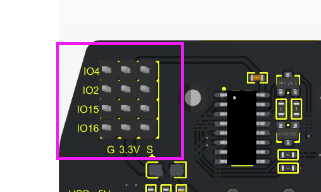

# 10. Common Problems

1. Select the wrong development board. Many ESP32 series are compatible but the internal library files are different. For example, when uploading the video car code, the development board selects "**ESP32 Dev Module"**, then you can upload the code successfully, but the code does not run. So for our video car, we must choose "**AI Thinker ESP32-CAM**".

2. Turn on the switch and the battery indicator light does not light up. It may be that the battery is out of power. Just charge it.

3. If you cannot see the serial port in the Arduino IDE after plugging in the USB, the first step is to check whether the CH340 driver is installed, the second step is to check whether the power switch of the car is turned on.

4. The IP address cannot be entered: the first step is to check whether it is connected to the correct wifi. If AP=1, then the mobile phone or tablet needs to be connected to the wifi of esp32-cam; if AP=0, the wifi connected to esp32-cam must be connected, which must be consistent with the wifi connected to the mobile phone or tablet (you can also open a hotspot on the mobile phone or tablet to connect it to the esp32-cam). 

Note: When AP=1, the IP address is "192.168.4.1". When AP=0, you need to obtain the IP address through the serial port, open the serial port of the arduino IDE and click reset button, then wait for the connection to wifi to get the IP.


